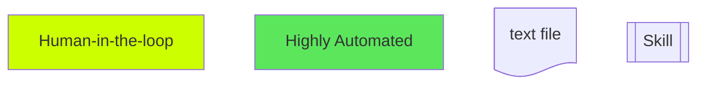
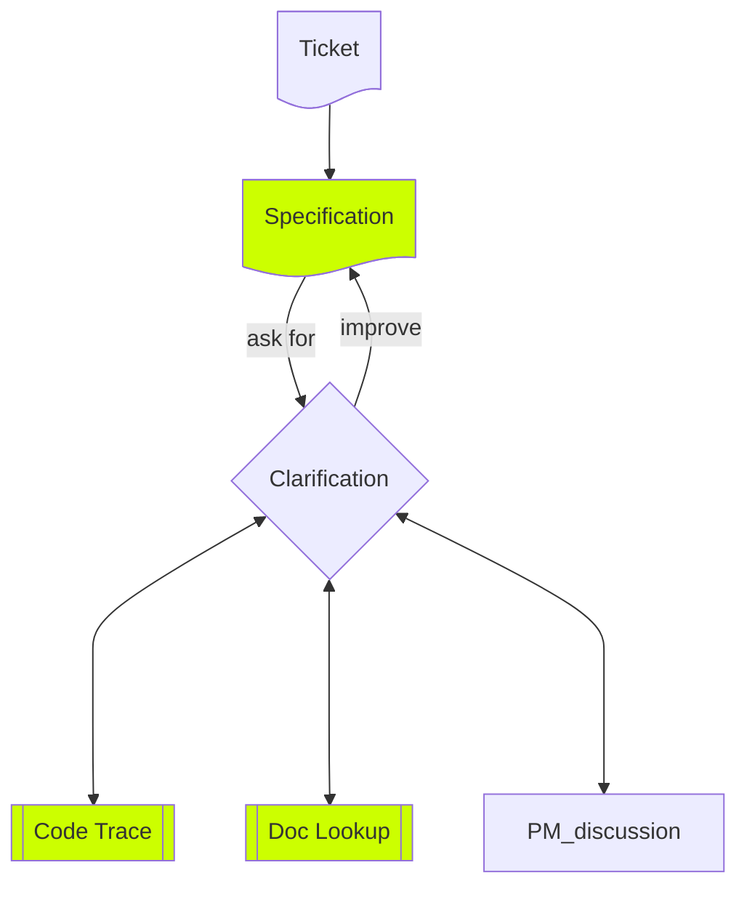
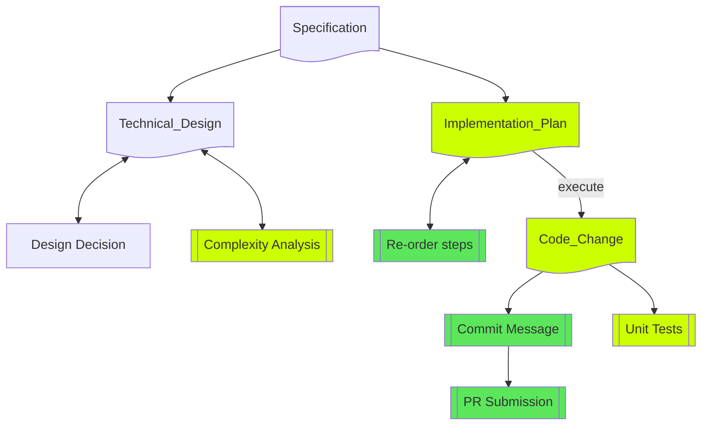
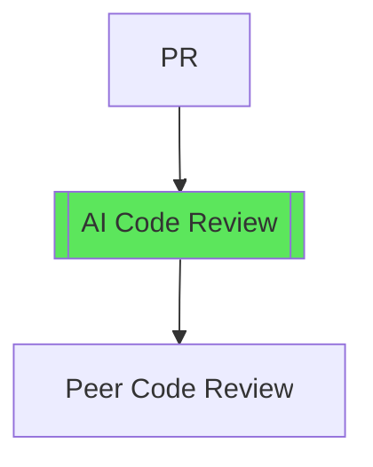
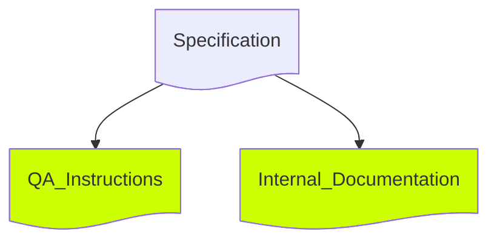

Since Skills came out, I can really feel the power of the agentic workflow. My workflow is still heavily human-in-the-loop, but certain parts can be highly automated.

## Workflow breakdown

### Legend

- The greener the box is, the more automated it could be.
- Skill means there are already agentic skills to help with the task.

### Requirements

- `Specification.md`: user story, requirements, edge cases — use the language you could communicate with PM
    - here are some useful prompts:
    - "Given the spec from Jira ticket `<link>`, understand the current user story deeply with these references: `<files>`. Provide a flow chart."
    - "Grill me with specs I need to clarify with the product manager. List out possible edge cases."
    - "Explain the current architecture of `<module1>`, `<module2>`. Draw a diagram."

Good requirements start with asking the right questions. I use AI to clarify implicit requirements understand how existing code actually behaves, which often reveals constraints no spec document mentions.

**Keep the spec files** reuse it for decision-making reference, QA instructions, tech sharing, and work logs.

Useful references / skills
- [Implicit Requirements](https://hhow09.github.io/blog/implicit-requirements/)
- [prd-taskmaster](https://github.com/anombyte93/prd-taskmaster)
- [Atlassian Remote MCP Server](https://www.atlassian.com/blog/announcements/remote-mcp-server)
- [Cursor Blame](https://cursor.com/docs/integrations/cursor-blame)

### Implementation

- `Technical_Design.md`: architecture, data flow, API design, complexity analysis — shared with technical roles
- `Implementation_Plan.md`: step-by-step plan, updated throughout the process
    - useful prompts:
    - "Break features into small, focused tasks"
    - "What's the suggested priority to minimize the risk of breaking existing features?"
    - "What's the required change for each task?" — useful for estimation

#### Writing code
- setup [rules](https://code.claude.com/docs/en/memory#organize-rules-with-claude/rules/) and [agent skills](https://platform.claude.com/docs/en/agents-and-tools/agent-skills/overview) to improve the quality of code
- **Execute first, then update the plan** every round based on real implementation progress.
- references
    - [awesome-cursorrules](https://github.com/PatrickJS/awesome-cursorrules/tree/main)
    - [vercel-react-best-practices](https://github.com/vercel-labs/agent-skills/tree/main/skills/react-best-practices)

### Code Review

### Further Usages

reuse the spec and implementation plan to generate QA instructions. The same artifact that guided development doubles as a testing guide for QA.

---

## Why are there still so many human-involved steps?

- **Clarifying requirements**: When products get complex, specs are easily overlooked by both PMs and devs — even with AI help. Integrating company-specific knowledge as context when writing specs would help.
- **Debugging**: Jumping between tickets, UI, logs, and codebase is still too fragmented for AI to handle end-to-end.

## Thoughts: The Bottleneck Shifted

The bottleneck of delivery has shifted from coding to review and other processes — testing, external dependencies, release pipelines — as noted in several posts ([1](https://blog.logrocket.com/ai-coding-tools-shift-bottleneck-to-review/), [2](http://reddit.com/r/softwaredevelopment/comments/1m0i8cx/team_burnout_from_code_review_bottlenecks_how_do/)). New challenges have already emerged: high volumes of low-quality PRs from less experienced engineers, and human QA becoming a release bottleneck.

## Ref

- [How I Use Claude Code](https://boristane.com/blog/how-i-use-claude-code/)
- [My LLM coding workflow going into 2026](https://addyosmani.com/blog/ai-coding-workflow/)
- [Cursor Agent Best Practices](https://cursor.com/blog/agent-best-practices)
- [Implicit Requirements](https://hhow09.github.io/blog/implicit-requirements/)
- [prd-taskmaster](https://github.com/anombyte93/prd-taskmaster)
