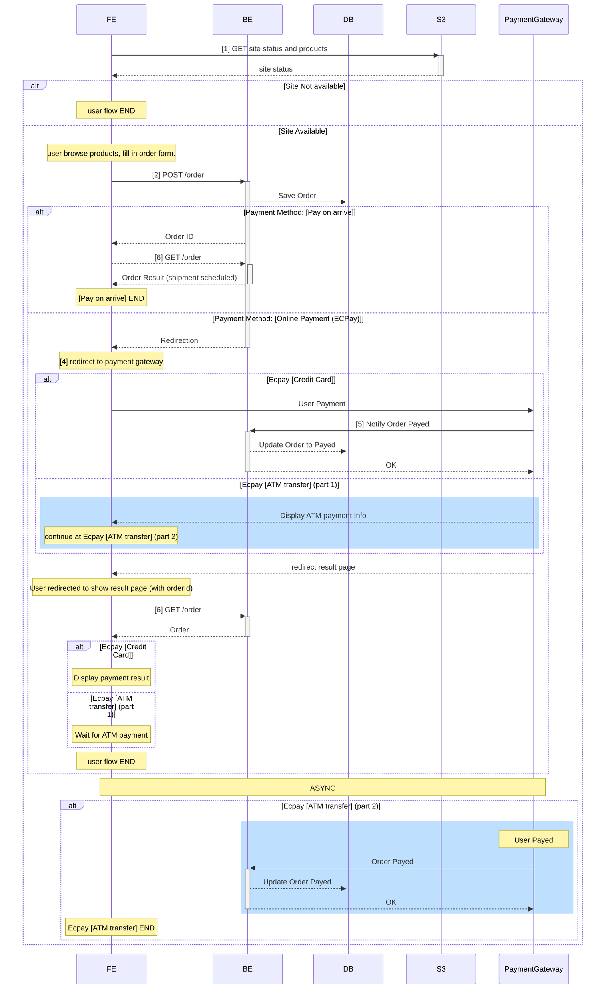

An overview of the e-commerce website with AWS Serverless stack developed by me.

## Website
[https://www.avocadotaiwan.com/](https://www.avocadotaiwan.com/)

> It is running in production so I cannot share the source code. WIP on share the code template.

## Features
- User can order products and pay with credit card or ATM transfer.
- User can query the order status with order id on order query page.
- Owner can see the order status (`created`, `paid`, `shipped`) on admin page.
- Owner can configurable product, unitprice, website status with admin interface.
- Owner can query and manage order with admin interface.

## Tech Stack
### Backend & Admin Service
- Written in Golang 
- Hosted on [AWS Lambda](https://aws.amazon.com/lambda/) for backend business logic.
- AWS [API Gateway](https://aws.amazon.com/api-gateway/) for exposing Lambda as REST API.
- AWS [DynamoDB](https://aws.amazon.com/pm/dynamodb/) as main database.
- AWS [S3](https://aws.amazon.com/s3/) for website status and static contents
- AWS [Cloudwatch](https://aws.amazon.com/cloudwatch/) for logging and monitoring.
  - [set log retention policy](https://docs.aws.amazon.com/AWSCloudFormation/latest/UserGuide/aws-resource-logs-loggroup.html#cfn-logs-loggroup-retentionindays) properly.
- [ECPay](https://corp.ecpay.com.tw/ecpay_en/) for payment integration supporting credit card and ATM transfer.

### Frontend
- [Next.js](https://nextjs.org/) (in Typescript) hosted on [Cloudflare pages](https://pages.cloudflare.com/) with [Cloudflare DNS](https://www.cloudflare.com/application-services/products/dns/)

### Deployment
- Environment: `staging`/ `production`
- Tool: [AWS Serverless Application Model (AWS SAM)](https://docs.aws.amazon.com/serverless-application-model/latest/developerguide/what-is-sam.html) for fully automated deployment.
    - template is shown in [AWS SAM Template](#aws-sam-template) section.

## Design Choice
1. Use **AWS Lambda** and **API Gateway** for API due to 
    - cost saving for **low RPS** website 
    - low maintenance effort
1. Use **AWS DynamoDB** for database 
    - choose NoSQL since there is no join between tables, only `order` table.
    - choose DynamoDB since it is serverless and easy to scale.
1. Use **AWS S3** for static contents and website status.
    - website status is for feature flag or announcement, which does not change frequently.
    - static contents rarely change.
    - Therefore leveraging [cache control](https://docs.aws.amazon.com/whitepapers/latest/build-static-websites-aws/controlling-how-long-amazon-s3-content-is-cached-by-amazon-cloudfront.html) for performance and cost saving.
1. Use **Next.js** for [Static Site Generation](https://nextjs.org/docs/pages/building-your-application/rendering/static-site-generation) 
    - since SEO is important for e-commerce website and server side rendering is an overkill for this project.

## Architecture
important steps are numbered and can be found in the diagram in next section.



## User Story

### Notes on Payment Option
1. Credit Card: ECPay will callback to backend with payment result, user immediately see the order status updated.
2. ATM Transfer: ECPay will asynchronously callback to backend with payment result.
3. Pay on Arrive: Payment is collected by logistics, owner can ship as long as order is created.

### Flow Diagram



## [AWS SAM](https://docs.aws.amazon.com/serverless-application-model/latest/developerguide/what-is-sam.html) Template
```yaml
AWSTemplateFormatVersion: "2010-09-09"
Transform: AWS::Serverless-2016-10-31

Parameters:
  # environment
  Env:
    Type: String
    Default: prod
    AllowedValues:
      - prod
      - stag
    Description: env
  # API Gateway ID
  ApiID:
    Type: String
    Description: API ID

Globals:
  Function:
    MemorySize: 128
    Architectures: ["arm64"]
    Handler: bootstrap
    Runtime: provided.al2
    Timeout: 5
    Tracing: Active
    Environment:
      Variables:
        ENV: !Ref Env
        TABLE_ORDER: !Join [ '-', [ <table-name>, !Ref Env] ]
        API_ENDPOINT: !Join [ '', [ https://, !Ref ApiID, .execute-api. , !Ref "AWS::Region", .amazonaws.com] ] # edit 2nd parameter
        LOG_DYNAMODB_REQ: false
        S3URL: <bucket-name>.s3.amazonaws.com

Resources:
  Api:
    # API Gateway
    # https://docs.aws.amazon.com/serverless-application-model/latest/developerguide/sam-resource-httpapi.html
    Type: AWS::Serverless::HttpApi
    Properties:
      CorsConfiguration:
        AllowOrigins:
          - "*"
        AllowMethods: 
          - GET
          - POST
          - OPTIONS
        AllowHeaders:
          - Content-Type
          - Accept
          - Access-Control-Allow-Headers
          - Access-Control-Request-Method
          - Access-Control-Request-Headers
          - Authorization
  
  # Lambda ping handler
  RootFunction:
    Type: AWS::Serverless::Function
    Properties:
      CodeUri: functions/root/
      Events:
        Api:
          Type: HttpApi
          Properties:
            Path: /
            Method: GET
            ApiId: !Ref Api            
    Metadata:
      BuildMethod: makefile

  # Lambda get order handler
  GetOrderFunction:
    Type: AWS::Serverless::Function
    Properties:
      CodeUri: functions/get-order/
      Events:
        Api:
          Type: HttpApi
          Properties:
            Path: /order
            Method: GET
            ApiId: !Ref Api
      Policies:
        - Version: "2012-10-17"
          Statement:
            - Effect: Allow
              Action: dynamodb:GetItem
              Resource: !GetAtt OrdersTable.Arn
            - Effect: Allow
              Action: dynamodb:Scan
              Resource: !GetAtt OrdersTable.Arn
            - Effect: Allow
              Action: dynamodb:Query
              Resource: 
                - !GetAtt OrdersTable.Arn
                - !Join [ '', [ !GetAtt OrdersTable.Arn, /index/*] ] # index
    Metadata:
      BuildMethod: makefile

  # post order handler
  PostOrderFunction:
    Type: AWS::Serverless::Function
    Properties:
      CodeUri: functions/post-order/
      Events:
        Api:
          Type: HttpApi
          Properties:
            Path: /order
            Method: POST
            ApiId: !Ref Api            
      Policies:
        - Version: "2012-10-17"
          Statement:
            - Effect: Allow
              Action: dynamodb:PutItem
              Resource: !GetAtt OrdersTable.Arn
    Metadata:
      BuildMethod: makefile

  # payment callback handler
  EcpayFunction:
    Type: AWS::Serverless::Function
    Properties:
      CodeUri: functions/ecpay-order/
      Events:
        Api:
          Type: HttpApi
          Properties:
            Path: /ecpay
            Method: POST
            ApiId: !Ref Api            
      Policies:
        - Version: "2012-10-17"
          Statement:
            - Effect: Allow
              Action: dynamodb:UpdateItem
              Resource: !GetAtt OrdersTable.Arn
    Metadata:
      BuildMethod: makefile      

  OrdersTable:
    Type: AWS::DynamoDB::Table
    Properties:
      TableName: !Join [ '-', [ <table-name>, !Ref Env] ]
      AttributeDefinitions:
        - AttributeName: ordertype
          AttributeType: S
        - AttributeName: idsk
          AttributeType: N
        - AttributeName: phone
          AttributeType: S
      KeySchema:
        # the partition key
        # https://docs.aws.amazon.com/amazondynamodb/latest/developerguide/bp-partition-key-design.html
        - AttributeName: ordertype
          KeyType: HASH
        # the sort key, essentially a timestamp
        - AttributeName: idsk
          KeyType: RANGE          
      BillingMode: PAY_PER_REQUEST
      LocalSecondaryIndexes:
        # local secondary index
        # user can query order by phone number
        - IndexName: lsi-phone
          KeySchema:
            - AttributeName: ordertype
              KeyType: HASH
            - AttributeName: phone
              KeyType: RANGE
          Projection:
            ProjectionType: ALL

Outputs:
  ApiUrl:
    Description: "API Gateway endpoint URL"
    Value: !Sub "https://${Api}.execute-api.${AWS::Region}.amazonaws.com/"
  ApiId:
    Description: Api id of HttpApi
    Value:
      Ref: Api
```