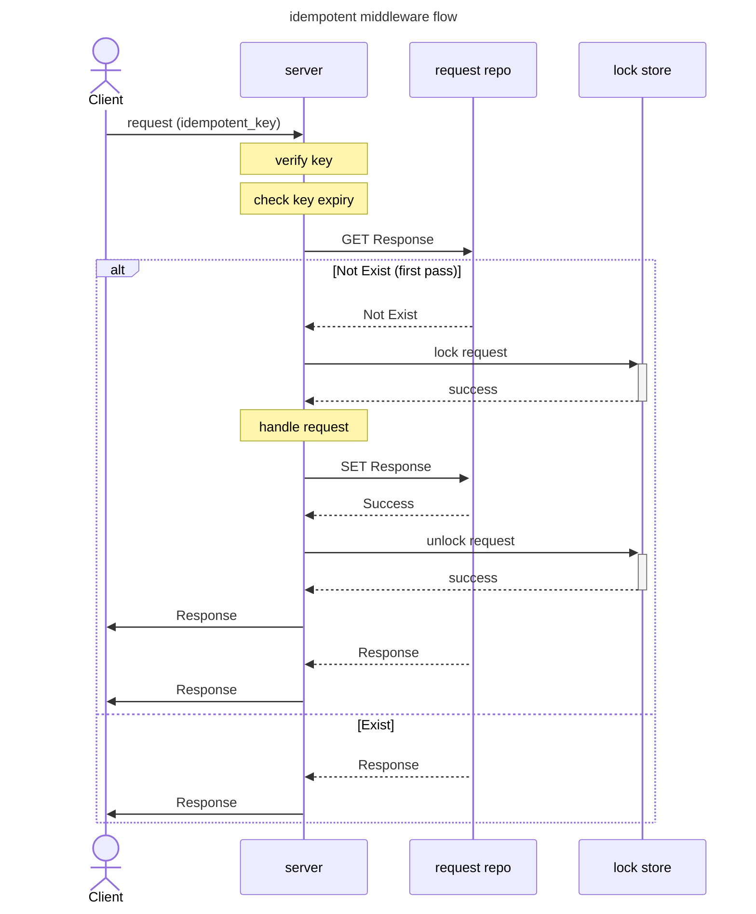

## Definition [^9]
Definition in [Wikipedia](https://en.wikipedia.org/wiki/Idempotence#Idempotent_functions)

> Idempotence is the property of certain operations in mathematics and computer science whereby they can be applied multiple times without changing the result beyond the initial application.

> idempotent elements are the functions f: E → E […] such that for all x in E, `f(f(x)) = f(x)` 

In computer science, the term idempotence may have a different meaning depending on the context in which it is applied

### In HTTP protocol
`GET`, `PUT`, and `DELETE` should be implemented in an idempotent manner according to the standard, but `POST` doesn't need to be.

### in event driven driven system
In event stream processing, idempotence refers to the ability of a system to produce the same outcome, even if the same file, event or message is received more than once. 

## Why we need idempotency in distributed system ?
### Requests retry is inevitable.
#### Failures Happen
>  Clients send requests to servers but might not get a response. It's impossible for clients to know if the response was lost or the server crashed before processing the request. To make sure its request is processed, the client has to resend the request. [^14]

> Many kinds of failures become apparent as requests taking longer than usual, and potentially never completing. When a client is waiting longer than usual for a request to complete, it also holds on to the resources it was using for that request for a longer time. When a number of requests hold on to resources for a long time, the server can run out of those resources. These resources can include memory, threads, connections, ephemeral ports, or anything else that is limited. [^1]

With idempotency, retry will just produce same side effect. 

E.g. `/POST record` 1st time, record inserted and returned. 2nd time, find the result and simply return it again.

### Duplicate Messages are Inevitable. [^2] [^12]

> I'm coining the phrase "effectively-once" for message processing with at-least-once + idempotent operations. [^13]

In event driven system, we talks about duplicate messages in both producer and consumer.

For producer side, duplicate messages happens when message broker fail to acknowledge due temporary error.

For consumer side, `at-least-once` delivery is the most common setting. Since exactly once delivery comes with much more complexity and configuration and performance hurt.

> An application typically uses a message broker, such as Apache Kafka or RabbitMQ, that implements at-least once delivery. At-least once delivery ensures that messages will be delivered. It does mean, however, that the message broker can invoke a message handler repeatedly for the same message. You must use the Idempotent Consumer pattern to ensure that your message handlers correctly handle duplicate messages.

## Determine if the operation naturally Idempotent ?
some business logic naturally has follwing properties could be idempotent by default.
- (1) has unique key known by the client 
- (2) state does not need to sync between client and server

### For Example
- (O) register user with email (as primary key)
  - operation is naturally idempotent
- withdraw account balance of user
  - (X) `withdraw(user_id, amount)` cannot be idempotent because the **current balance**  is not provided beforehand.
  - (O) `withdraw(user_id, amount, current_balance)` can be made idempotent using `current_balance` as optimistic lock. However, the requester need to retrieve `current_balance` in advance.  

### The request included an external API call
- (O) external API provides idempotent design
  - e.g. [Rocket Ride](https://brandur.org/idempotency-keys#rocket-rides-phases)

- (X) sending an email
  - contains non-idempotenet [foreign state mutations](#foreign-state-mutations)

## Idempotency key
### RFC
- [RFC Draft: The Idempotency-Key HTTP Header Field](https://datatracker.ietf.org/doc/html/draft-ietf-httpapi-idempotency-key-header-04)
### Definition [^3]
> An idempotency key is a unique value that’s generated by a client and sent to an API along with a request. The server stores the key to use for bookkeeping the status of that request on its end. If a request should fail partway through, the client retries with the same idempotency key value, and the server uses it to look up the request’s state and continue from where it left off. The name “idempotency key” [comes from Stripe’s API](https://stripe.com/blog/idempotency).

### Key Generation
- The idempotency key that is supplied as part of every POST request MUST be unique and MUST NOT be reused with another request with a different request payload. [^4]
- Uniqueness of the key MUST be defined by the resource owner and MUST be implemented by the clients of the resource server. [^4]


## Implementations
---
## Idempotent Middleware
Idempotency middleware allows for fault-tolerant APIs where duplicate requests.

business logic does not aware of the idempotent key

### Flow


### Idempotency Fingerprint [^5]
>  An idempotency fingerprint MAY be used in conjunction with an idempotency key to determine the uniqueness of a request.  Such a fingerprint is generated from request payload data by the resource server. 

For Example:
```go
func fingerPrint(r *http.Request) ([]byte, error) {
	key := r.Header.Get("Idempotency-Key")
	body, err := io.ReadAll(r.Body)
	if err != nil {
		return nil, fmt.Errorf("fail to read body, err: %w" + err.Error())
	}
	fields := map[string]any{
		"body": string(body),
		"path": r.URL.Path,
		"key":  key,
	}
	b, err := json.Marshal(fields)
	if err != nil {
		return nil, fmt.Errorf("fail to marshal fields, err: %w" + err.Error())
	}
	sum := sha1.Sum(b)
	return sum[:], nil
}
```

### Key Expiration
Does the server store idempotency keys forever? [^11]
#### Stripe [^6]
>  Clients can safely retry requests that include an idempotency key as long as the second request occurs within 24 hours from when you first receive the key (keys expire out of the system after 24 hours).


#### RFC [^7] [^8]
> The resource MAY enforce time based idempotency keys, thus, be able to purge or delete a key upon its expiry.  The resource server SHOULD define such expiration policy and publish it in the documentation.

> Resource server MUST publish idempotency related specification.  This specification MUST include expiration related policy if applicable. Server is responsible for managing the lifecycle of the idempotency key.


### Frameworks
- [Idempotency middleware for Fiber](https://github.com/gofiber/fiber/blob/master/middleware/idempotency/idempotency.go)


---
## Integrate Idempotent key into business logic
the blog post [Implementing Stripe-like Idempotency Keys in Postgres](https://brandur.org/idempotency-keys#acyclic-state-machine) provides example content in detail.

TLDR: 
- break up steps into atomic phases
- store the state in each atomic phases along with idempotent key
- when user retry with same idempotent key, fetch the current state and continue the flow.
- the external API call need to be idempotent.


### Concept
#### Foreign state mutations [^3]
> To shore up our backend, it’s key to identify where we’re making foreign state mutations; that is, calling out and manipulating data on another system. This might be creating a charge on Stripe, adding a DNS record, or sending an email.

> Some foreign state mutations are idempotent by nature (e.g. adding a DNS record), some are not idempotent but can be made idempotent with the help of an idempotency key (e.g. charge on Stripe, sending an email), and some operations are not idempotent, most often because a foreign service hasn’t designed them that way and doesn’t provide a mechanism like an idempotency key.

#### Atomic phase [^3]
> An atomic phase is a set of local state mutations that occur in transactions between foreign state mutations.

> Atomic phases should be safely committed before initiating any foreign state mutation. If the call fails, our local state will still have a record of it happening that we can use to retry the operation.

#### Example: Rocket Ride



#### Example: Medusa [^10]


### What if External API is not idempotent [^3]
> Unfortunately, not every service will make this guarantee. If we try to make a non-idempotent foreign state mutation and we see a failure, we may have to persist this operation as permanently errored. In many cases we won’t know whether it’s safe to retry or not, and **we’ll have to take the conservative route and fail the operation.**

## Companies Posts
- Airbnb: [Avoiding Double Payments in a Distributed Payments System](https://medium.com/airbnb-engineering/avoiding-double-payments-in-a-distributed-payments-system-2981f6b070bb)
- Square: [Working with APIs: Idempotency](https://developer.squareup.com/docs/working-with-apis/idempotency)
- Stripe：[API Reference: Idempotent Requests](https://stripe.com/docs/api/idempotent_requests)

## Reference
[^1]: [AWS Timeouts, retries, and backoff with jitter](https://aws.amazon.com/builders-library/timeouts-retries-and-backoff-with-jitter/)
[^2]: [Microservice Architecture: Idempotent consumer pattern](https://microservices.io/post/microservices/patterns/2020/10/16/idempotent-consumer.html)
[^3]: [Implementing Stripe-like Idempotency Keys in Postgres](https://brandur.org/idempotency-keys)
[^4]: [RFC Idempotency-Key 2.2](https://datatracker.ietf.org/doc/html/draft-ietf-httpapi-idempotency-key-header-04#section-2.2)
[^5]: [RFC Idempotency-Key 2.4](https://datatracker.ietf.org/doc/html/draft-ietf-httpapi-idempotency-key-header-04#section-2.4)
[^6]: [Stripe Doc](https://stripe.com/docs/error-low-level#post-requests)
[^7]: [RFC Idempotency-Key 2.3](https://datatracker.ietf.org/doc/html/draft-ietf-httpapi-idempotency-key-header-04#section-2.3)
[^8]: [RFC Idempotency-Key 2.5](https://datatracker.ietf.org/doc/html/draft-ietf-httpapi-idempotency-key-header-04#section-2.5)
[^9]: [Idempotency Key：原理與實測](https://william-yeh.net/post/2020/03/idempotency-key-test/)
[^10]: [An open-source implementation of idempotency keys in NodeJS with Express](https://medusajs.com/blog/idempotency-nodejs-express-open-source/)
[^11]: [My Thoughts on Idempotency](https://andrewjdawson2016.medium.com/my-thoughts-on-idempotency-9a2f40a01a7e)
[^12]: [Idempotent Processing with Kafka](https://nejckorasa.github.io/posts/idempotent-kafka-procesing/#understanding-the-intricacies-of-exactly-once-semantics-in-kafka)
[^13]: [Viktor Klang's Twitter](https://twitter.com/viktorklang/status/789036133434978304)
[^14]: [Martin Fowler: Idempotent Receiver](https://martinfowler.com/articles/patterns-of-distributed-systems/idempotent-receiver.html)