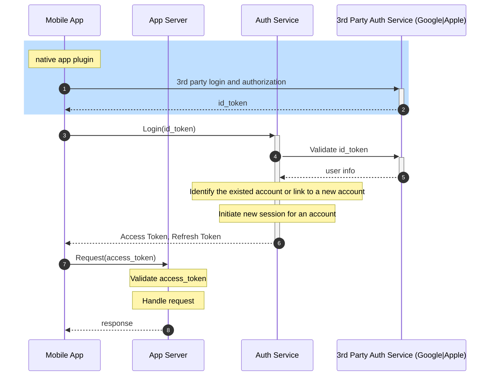

Some notes after working on Auhtorization server at work.

## Requirement
- support authentication and authorization for application servers.
- Support different authorization methods for an account (e.g. google, apple and others... ).
    - goal: login process for applications are unified **as if interacting with a single authorization server**.
- Manage user account and sessions for application servers.
- Support refresh token rotation.
- Should follow [OAuth 2.0 Authorization Framework](https://datatracker.ietf.org/doc/html/rfc6749)

## Related RFCs
- [RFC 6749 OAuth 2.0 Authorization Framework](https://datatracker.ietf.org/doc/html/rfc6749)
- [RFC 8252 OAuth 2.0 for Native Apps](https://datatracker.ietf.org/doc/html/rfc8252)
- [RFC 7662 OAuth 2.0 Token Introspection](https://datatracker.ietf.org/doc/html/rfc7662)

## Terms
### Client
>  An application making protected resource requests on behalf of the resource owner and with its authorization.  The term "client" does not imply any particular implementation characteristics (e.g., whether the application executes on a server, a desktop, or other devices).

[REF] [RFC 6749 1.1](https://datatracker.ietf.org/doc/html/rfc6749#section-1.1)

#### native application client
> A native application is a public client installed and executed on the device used by the resource owner.  Protocol data and credentials are accessible to the resource owner.  It is assumed that any client authentication credentials included in the application can be extracted.  On the other hand, dynamically issued credentials such as access tokens or refresh tokens can receive an acceptable level of protection.  At a minimum, these credentials are protected from hostile servers with which the application may interact.  On some platforms, these credentials might be protected from other applications residing on the same device.

[REF] [RFC 6749 2.1](https://datatracker.ietf.org/doc/html/rfc6749#section-2.1)

### ID Token

> The ID Token is a security token that contains Claims about the Authentication of an End-User by an Authorization Server when using a Client, and potentially other requested Claims. The ID Token is represented as a [JSON Web Token (JWT)](https://openid.net/specs/openid-connect-core-1_0.html#JWT) [JWT].

[REF] [OpenID Connect Core 1.0](https://openid.net/specs/openid-connect-core-1_0.html#IDToken)

- [Google supports open ID Connect](https://developers.google.com/identity/openid-connect/openid-connect)
- [Apple Successfully Implements OpenID Connect with Sign In with Apple](https://openid.net/apple-successfully-implements-openid-connect-with-sign-in-with-apple/)

## Login Flow
### Reference
- Login flow mainly follows [OAuth2.0: Client Credentials Grant](https://datatracker.ietf.org/doc/html/rfc6749#section-4.4)
- 3rd Party Authentication flow follows [OpenID Connect: 3.1.2.1.  Authentication Request](https://openid.net/specs/openid-connect-core-1_0.html#AuthRequest)

### Participants
- Mobile App (client)

- Application Server (resource server)
    - responsible for business logic
    - responsible for validating `access_token`

- Auth Service
    - responsible for user authentication: validating `id_token`
    - responsible for user authorization: issue `access_token`
    - responsible manage user account and sessions for application server

- 3rd Party Auth Service (e.g. Google, Apple)
    - responsible for user authentication: issue `id_token`

### Flow Chart

### Notes
1.  for step 1 - 2, [Roles](https://datatracker.ietf.org/doc/html/rfc6749#section-1.1) in the context of OAuth 2.0
    - mobile App served as [client](https://datatracker.ietf.org/doc/html/rfc6749#section-1.1)
    - 3rd Party Auth Service (Google, Apple) served as [authorization server](https://datatracker.ietf.org/doc/html/rfc6749#section-1.1)
    - App Server served as [resource server](https://datatracker.ietf.org/doc/html/rfc6749#section-1.1)

1. details flow for step 1 - 2
    
    - [REF] [Google OAuth: Installed applications](https://developers.google.com/identity/protocols/oauth2#installed)
1.  after step 3, [Roles](https://datatracker.ietf.org/doc/html/rfc6749#section-1.1) in the context of OAuth 2.0
    - mobile App served as [client](https://datatracker.ietf.org/doc/html/rfc6749#section-1.1)
    - **Auth Service served as [authorization server](https://datatracker.ietf.org/doc/html/rfc6749#section-1.1)**
    - App Server served as [resource server](https://datatracker.ietf.org/doc/html/rfc6749#section-1.1)

1. step 7: resource server token validation
> The resource server MUST validate the access token and ensure ... *[RFC 6749 7](https://datatracker.ietf.org/doc/html/rfc6749#section-7)*
1. step 7: how to validate access token ? 
> These include using structured token formats such as JWT or proprietary inter-service communication mechanisms *[RFC 7662](https://datatracker.ietf.org/doc/html/rfc7662#section-1)*

## Refresh Token Rotation
in another post: [OAuth 2.0 - Refresh Token and Rotation](/blog/oauth2-refresh-token)

---
## Tricky Parts
### Client authentication for mobile apps
> Secrets that are statically included as part of an app distributed to multiple users should not be treated as confidential secrets, as one user may inspect their copy and learn the shared secret.
> Authorization servers that still require a statically included shared secret for native app clients MUST treat the client as a public client

[REF] [RFC 8252 Client Authentication](https://datatracker.ietf.org/doc/html/rfc8252#section-8.5)

#### Risk: client impersonation
> In short, OAuth client impersonation is when one OAuth client pretends to be another, usually to take advantage of any capabilities that the legitimate client may have that are not granted to other clients.

#### Are there any solutions for client impersonation?
> For mobile apps, there is more hope. Apple has an API known as “App Attestation”, and Google has a similar API called “Google Play Integrity”. Both APIs work similarly, with a few technical differences. At a high level, both of them involve the application making a request to the operating system to sign some data. Then the app includes that signed string in the call it makes to the developer’s API. The API can validate the signature against the public key from Apple and Google to determine its confidence level that the API request is made from a real version of the mobile app.

[REF][Okta: The Identity of OAuth Public Clients](https://developer.okta.com/blog/2022/06/01/oauth-public-client-identity#what-is-oauth-client-impersonation)