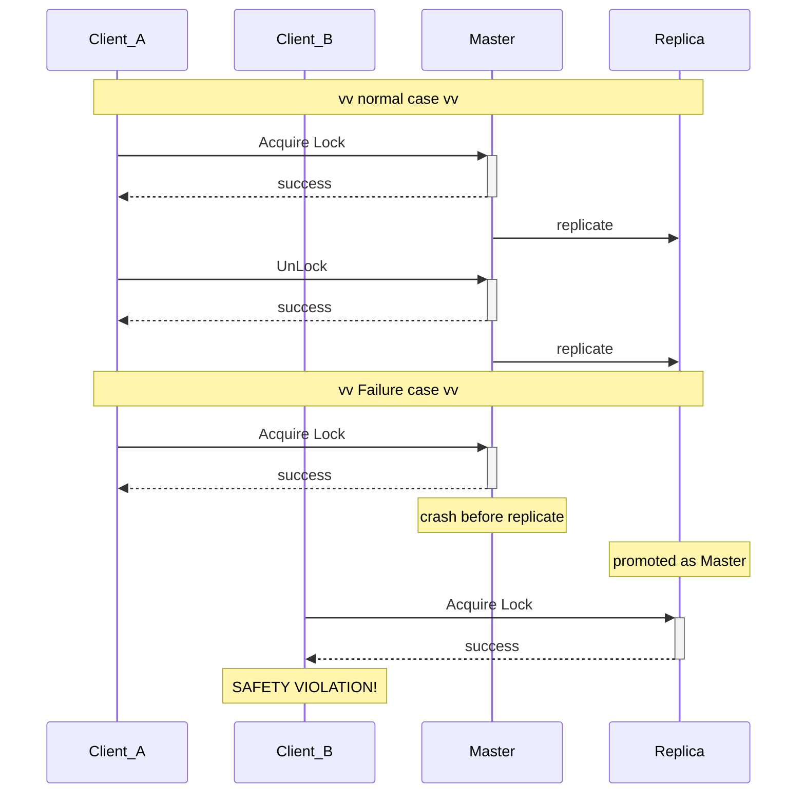

Distributed Lock with Redis and reviews on Redlock algorithm.

## Lock Command With Single Redis Instance [^1]
### Lock
```
SET resource_name my_random_value NX PX 30000
```

### Unlock
 
```
if redis.call("get",KEYS[1]) == my_random_value then
    return redis.call("del",KEYS[1])
else
    return 0
end
```


## Failure mode
### 1. [Single Instance] Redis down (single point of failure)
Solution: use Replica

### 2. [Replica] The Leader crashes before the write to the key is transmitted to the replica. [^2]


#### Solution
Consensus algorithm e.g. [Redlock](#redlock-algorithm)


## Redlock Algorithm [^1]
### Prerequisite
> In the distributed version of the algorithm we assume we have N Redis masters. Those nodes are totally independent, so we don’t use replication or any other implicit coordination system. 

### Overview [^6]
> The answer is through majority consensus. Since one Redis is not reliable, we form a committee of multiple Redis. If and only if more than half of the committee members agree, the lock will take effect; otherwise, the lock is invalid.

> The members can be single, master-slave, or even clusters, but nevertheless, they are independent of each other, in other words, they are not duplicates of each other, not to mention the same cluster.
### Flow


### go-redsync/redsync [^3]
code snippet to acuire lock.
```go
// https://github.com/go-redsync/redsync/blob/master/mutex.go

// lockContext locks m. In case it returns an error on failure, 
// you may retry to acquire the lock by calling this method again.
func (m *Mutex) lockContext(ctx context.Context, tries int) error {
	if ctx == nil {
		ctx = context.Background()
	}

    // every lock is "signed" with a random string, so the lock will
    // be removed only if it is still the one that was set by the client
    // trying to remove it.
	value, err := m.genValueFunc()
	if err != nil {
		return err
	}

	var timer *time.Timer
	for i := 0; i < tries; i++ {
		// ... timer and retry part

        // 1. Get the current time.
		start := time.Now()

        // 2. … All the steps needed to acquire the lock …
		n, err := func() (int, error) {
            // timeout factor: when setting the lock in each instance, 
            // the client uses a timeout which is small compared to the
            // total lock auto-release time in order to acquire it.
			ctx, cancel := context.WithTimeout(ctx, time.Duration(int64(float64(m.expiry)*m.timeoutFactor)))
			defer cancel()
			return m.actOnPoolsAsync(func(pool redis.Pool) (bool, error) {
				return m.acquire(ctx, pool, value)
			})
		}()

        // 3. Get the current time, again.
		now := time.Now()
        
        // 4. Check if we are already out of time, or if we acquired the lock fast enough.
		until := now.Add(m.expiry - now.Sub(start) - time.Duration(int64(float64(m.expiry)*m.driftFactor)))

        // quorum: len(r.pools)/2 + 1
        // As long as the quorum is met, we can assume the lock is acquired.
		if n >= m.quorum && now.Before(until) {
			m.value = value
			m.until = until
			return nil
		}

        // lock not acquired
        // unlock previously locked key
		func() (int, error) {
			ctx, cancel := context.WithTimeout(ctx, time.Duration(int64(float64(m.expiry)*m.timeoutFactor)))
			defer cancel()
			return m.actOnPoolsAsync(func(pool redis.Pool) (bool, error) {
				return m.release(ctx, pool, value)
			})
		}()
        // exceed max retry times
		if i == m.tries-1 && err != nil {
			return err
		}
	}

	return ErrFailed
}
```

noted that at **indefinite network delay or GC pause could happend** [^3], so we need to re-check expiry time at step 3 and 4

> Note that whatever happens between 1 and 3, you can add the network delays you want, the lock will always be considered not valid if too much time elapsed, so Redlock looks completely immune from messages that have unbound delays between processes. It was designed with this goal in mind, and I cannot see how the above race condition could happen. [^4]


---
## Review on Readlock by Martin Kleppmann [^1]
### Issue 1: Clock Skew
> What happens if a clock on one of the Redis nodes jumps forward?

> 1. Client 1 acquires lock on nodes A, B, C. Due to a network issue, D and E cannot be reached.
> 2. The clock on node C jumps forward, causing the lock to expire.
> 3. Client 2 acquires lock on nodes C, D, E. Due to a network issue, A and B cannot be reached.
> 4. Clients 1 and 2 now both believe they hold the lock.

#### Response from antirez [^4]
> Martin says that the clock can randomly jump in a system because of two issues:
> 1. The system administrator manually alters the clock.
> 2. The ntpd daemon changes the clock a lot because it receives an update.

> The above two problems can be avoided by “1” not doing this (otherwise even corrupting a Raft log with “echo foo > /my/raft/log.bin” is a problem), and “2” using an ntpd that does not change the time by jumping directly, but by distributing the change over the course of a larger time span.

### Issue 2: Long GC at Client Process [^3]



> 1. Client 1 requests lock on nodes A, B, C, D, E.
> 2. While the responses to client 1 are in flight, client 1 goes into stop-the-world GC.
> 3. Locks expire on all Redis nodes.
> 4. Client 2 acquires lock on nodes A, B, C, D, E.
> 5. Client 1 finishes GC, and receives the responses from Redis nodes indicating that it successfully acquired the lock (they were held in client 1’s kernel network buffers while the process was paused).
> 6. Clients 1 and 2 now both believe they hold the lock.

#### Reason 
> This bug is not theoretical: HBase used to [have this problem](http://www.slideshare.net/enissoz/hbase-and-hdfs-understanding-filesystem-usage) [3,4]. Normally, GC pauses are quite short, but “stop-the-world” GC pauses have sometimes been known to last for [several minutes](https://blog.cloudera.com/blog/2011/02/avoiding-full-gcs-in-hbase-with-memstore-local-allocation-buffers-part-1/) [5] – certainly long enough for a lease to expire.


#### Response from antirez [^4]
> If you read the Redlock specification, that I hadn't touched for months, you can see the steps to acquire the lock are:
> 1. Get the current time.
> 2. … All the steps needed to acquire the lock …
> 3. Get the current time, again.
> 4. Check if we are already out of time, or if we acquired the lock fast enough.
> 5. Do some work with your lock.

He admitted that if long GC happens between step 3 and 4, it will actually calculate wrong expiration time.

> Let me tell again how this problem is common with *all the distributed locks implementations*, and how the token as a solution is both unrealistic and can be used with Redlock as well. [^4]

### Solution from Martin: Fencing token [^3]

> In this context, a fencing token is simply a number that increases (e.g. incremented by the lock service) every time a client acquires the lock.

> Note this requires the storage server to take an active role in checking tokens, and rejecting any writes on which the token has gone backwards.



In simple word: use monotonic counter to know "the order of different client acquiring same lock"

> However, this leads us to the first big problem with Redlock: it does not have any facility for generating fencing tokens. The algorithm does not produce any number that is guaranteed to increase every time a client acquires a lock.

#### Java Implementation: redisson FencedLock [^5]
> This type of lock maintains the fencing token to avoid cases when Client acquired the lock was delayed due to long GC pause or other reason and can't detect that it doesn't own the lock anymore. To resolve this issue token is returned by locking methods or getToken() method. 

> Token should be checked if it's greater or equal with the previous one by the service guarded by this lock and reject operation if condition is false.

##### Example
```java
RFencedLock lock = redisson.getFencedLock("myLock");
...
// or wait for lock aquisition up to 100 seconds 
// and automatically unlock it after 10 seconds
Long token = lock.tryLockAndGetToken(100, 10, TimeUnit.SECONDS);
if (token != null) {
   try {
     // check if token >= old token
     ...
   } finally {
       lock.unlock();
   }
}
```

### The synchrony assumptions of Redlock [^2]

> These examples show that Redlock works correctly only if you assume a synchronous system model – that is, a system with the following properties:
> - bounded network delay (you can guarantee that packets always arrive within some guaranteed maximum delay),
> - bounded process pauses (in other words, hard real-time constraints, which you typically only find in car airbag systems and suchlike), and
> - bounded clock error (cross your fingers that you don’t get your time from a bad NTP server).

> Redlock assumes that delays, pauses and drift are all small relative to the time-to-live of a lock; 

> if the timing issues become as large as the time-to-live, the algorithm fails.


## Conclusion
1. Redlock is heavy
2. Implement fencing token for consistency.
3. Count the clock drift and network delay. e.g. lock watchdog [^5], Extending the lock[^1]
4. Don't alter the system time.


## Reference
[^1]: [Redis: Distributed Locks with Redis](https://redis.io/docs/manual/patterns/distributed-locks/)
[^2]: [Martin Kleppmann: How to do distributed locking](https://martin.kleppmann.com/2016/02/08/how-to-do-distributed-locking.html)
[^3]: [go-redsync/redsync](https://github.com/go-redsync/redsync)
[^4]: [antirez: Is Redlock safe?](http://antirez.com/news/101)
[^5]: [redisson: Fenced Lock](https://github.com/redisson/redisson/wiki/8.-distributed-locks-and-synchronizers#810-fenced-lock)
[^6]: [Explain Redlock in Depth](https://medium.com/starbugs/explain-redlock-in-depth-dba95c107102)